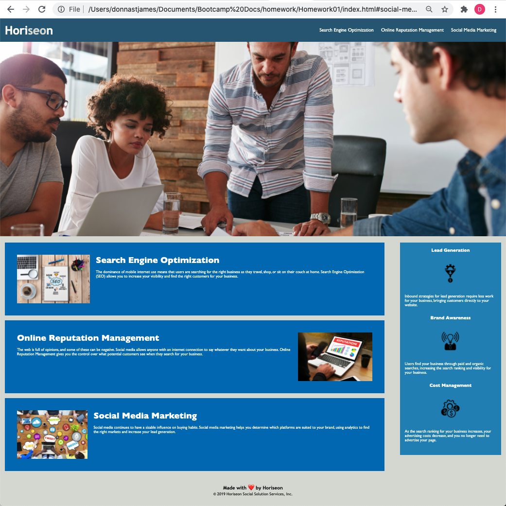

# Homework01: Code Refactor

## Description

This is a project that refactored existing code to improve web accessibility.  I learned that there are certain ways in making a website more accessible.  It is important that the HTML is properly sectioned, and semantic tags are used appropriately.  I also learned that improved accessibility also increases a website's findability as it meets certain criteria that a search engine looks for.

## Applied Changes

1. Created a `header` element to house the title.

2. Created a `nav` element to house the links on top of the page.

3. Added `alt` to make all the links accessible.

4. Created an `aside` element.

5. Made appropriate changes (including comments) to the CSS worksheet, and consolidated classes without changing the look or functionality of the original application.

